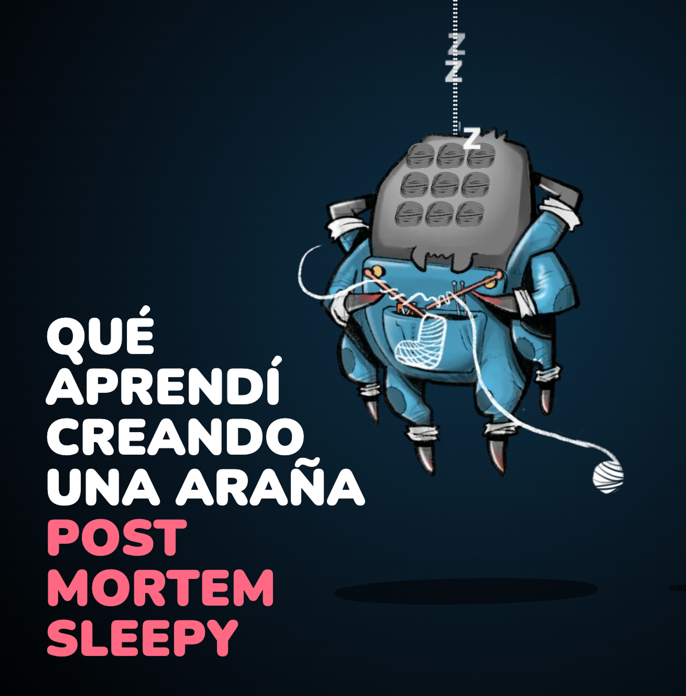

# Solution to the Genially Test

The test includes the instructions in its [original README](./docs/TEST_REQUIREMENTS.md).

🇪🇸 The Spanish version of this README can be found [here](./docs/README_ES.md).

## Demo

Link: [genially.zenekezene.com](https://genially.zenekezene.com/)

## Installation

This project has been developed using `Node 18.9.0`. To install, simply run the command:

    npm install

## Commands

Launch the project in development mode:

    npm run start

Run the test suite:

    npm run test
    npm run test:e2e
    npm run test:e2e:ui

Create a build:

    npm run build

---

## New Packages Installed

I have updated the packages to their latest versions and installed new packages. These are:

- **[tinycolor2](https://github.com/bgrins/TinyColor)**: used for calculating color variations in JS.
- **[localforage](https://github.com/localForage/localForage)**: normalizes access to browser persistence systems.
- **[mst-persist](https://github.com/agilgur5/mst-persist)**: persists mobx-state-tree stores.
- **[react-hotkeys-hook](https://github.com/JohannesKlauss/react-hotkeys-hook)**: a hook for using key combinations declaratively.
- **[Prettier](https://prettier.io/)**: opinionated code formatter.
- **[Vitest](https://vitest.dev/)**: testing framework.
- **[Playwright](https://playwright.dev/)**: enables reliable end-to-end testing for modern web apps.

Additionally, I have deprecated react-scripts in favor of Vitest for running tests.

---

## FAQS

### What architecture did you use?

I chose a simple architecture focused on UI, with layer separation by roles. There's no DDD, no hexagonal architecture, no domain layer. I aimed to speed up development and avoid endemic domain incentivization, as most requirements respond to visual micro-interactions. There's no repository pattern, VOs, aggregates, use cases, etc. This is intentional. I believe good state management (I was unfamiliar with `mobx-state-tree`) and effective use of React are sufficient for this scope.

### Why JS and not TS?

Honestly, I didn't use `TypeScript` because I'm not knowledgeable enough to set up a project like this with it. I feel more comfortable with JS. But I think I learn quickly.

### Why does it look like this?

I wanted to present a minimalist interface, with a folder creator purpose. I also chose a limited color palette and icons of the same style. I enjoy working on UX/UI.

### What about the styles?

I chose to work with vanilla CSS, avoiding preprocessors like [SASS](https://sass-lang.com/), or post-processors like [PostCSS](https://postcss.org/). I think it was sufficient. For methodology, I used [BEM](https://getbem.com/). I believe it's important to [mantain a low CSS specificity curve](https://csswizardry.com/2014/10/the-specificity-graph/) throughout the style sheets.

### What about the tests?

- I tried to test elements that made sense to test, such as component testing or unit tests for components. These are black boxes from which I use their public interface to assert behaviors, not implementation details.
- Always from the user's perspective, so I added A11y to retrieve elements.
- The more complex components are tested using Playwright.
- There is also implicit testing, such as for services.
- Hooks are tested by simulating mounting them in "dumb" components.
- I did not practice TDD (neither inside-out nor outside-in).
- I have integrated the tests in Github through Github Actions.

---

## Required Functionalities

- [✅] Add and remove boxes.
- [✅] Select a box, which should visually indicate that is selected
- [✅] Drag the boxes around using interact.js and using React refs.
- [✅] Keep in mind you should be able to drag a box even if it's not selected when the draging starts.
- [✅] Changing a box's color.
- [✅] Display a counter indicating how many boxes are selected.
- [✅] Support selection, dragging and color changing for multiple boxes.
- [✅] Save the state of the app locally and restore it when it loads.
- [✅] Undo / Redo capabilities.

## Extra Features

- [✅] When adding a box, it will be created within the canvas boundaries.
- [✅] When selecting a box, options to modify the box appear. These are:
  - **Edit the box text**, by double-clicking with the mouse or clicking on the pencil icon.
  - **Edit the text color** by clicking on the 'A' icon.
  - Delete and change the box's background color.
- [✅] **The box counter is visual, not numeric**. These boxes are marked as selected if we select their large versions, and vice versa.
- [✅] I created a **selection tool** to select multiple boxes at once.
- [✅] If we have one or more boxes selected, we can deselect them by clicking on the canvas.

---

## Keyboard Shortcuts

- With a box selected, press `Delete` or `Backspace` to delete the box.
- Pressing `Shift` allows you to select more than one box.
- With one or more boxes selected, press `Escape` to deselect them.
- To undo an action, press `Control + Z` or `Command + Z` (MacOS).
- To redo an action, press `Control + Shift + Z` or `Command + Shift + Z` (MacOS).

---

## Closing Remarks

I think this is one of the most interesting technical tests I've ever done. Even if we don't match, thank you for giving me the opportunity to work on this test. It was a lot of fun, and I discovered some cool things along the way, so thank you very much for the opportunity!

## Links

Here are some related front-end projects:

[Do the right thing](https://labs.zenekezene.com/).

[Montando en bicicleta](https://bike.zenekezene.com).

[Picasso, editor de dibujo sencillo](https://picasso2022.netlify.app/).

[Despierta a Sleepy Spider antes de que empiece la BilboStack!](https://bilbostack.zenekezene.com/).

[Qué aprendí creando una araña](https://zeneke.notion.site/Sleepy-en-Bilbostack-2024-Post-Mortem-5ee0676b122441d38949e8990b703b11).

[Amigue invisible tecth 2020](https://creaunalex.netlify.app/#/).

## Contact

Twitter: [@zenekezene](https://twitter.com/zenekezene).

Instagram: [@zenekezene](https://www.instagram.com/zenekezene/).

Linkedin: [@hectorvillarm](https://www.linkedin.com/in/hectorvillarm/).

Web: [www.zenekezene.com](https://zenekezene.com/)

