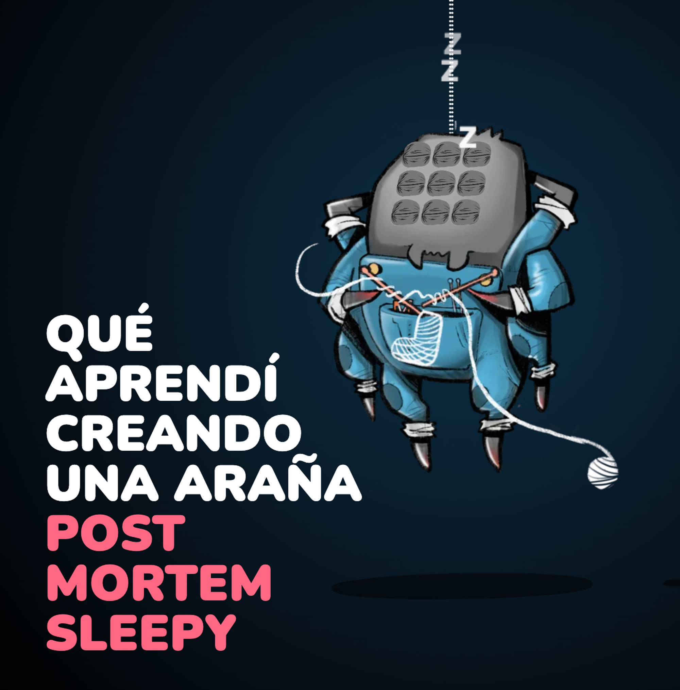

# Solución al test de Genially

El test viene con el enunciado en su [README original](./TEST_REQUIREMENTS.md).

🇬🇧 La versión en inglés de este README se encuentra [aquí](../README.md).

## Demo

Link: [genially.zenekezene.com](https://genially.zenekezene.com/)

## Instalación

Este proyecto se ha desarrollado con una versión de `Node 18.9.0`.
Para instalar, basta con lanzar el comando:

    npm install

## Comandos

Lanzar el proyecto en modo desarrollo:

    npm run start

Lanzar la batería de tests:

    npm run test
    npm run test:e2e
    npm run test:e2e:ui

Crear una build:

    npm run build

---

## Nuevos paquetes instalados

He actualizado los paquetes a sus versiones más actuales, así como instalado nuevos paquetes. Estos son:

- **[tinycolor2](https://github.com/bgrins/TinyColor)**: se encarga de calcular variaciones de colores por JS.
- **[localforage](https://github.com/localForage/localForage)**: se encarga de normalizar el acceso a sistemas de persistencia del navegador.
- **[mst-persist](https://github.com/agilgur5/mst-persist)**: se encarga de persistir stores de mobx-state-tree.
- **[react-hotkeys-hook](https://github.com/JohannesKlauss/react-hotkeys-hook)**: un hook para usar combinaciones de teclas de forma declarativa.
- **[Prettier](https://prettier.io/)**: formateo de ficheros.
- **[Vitest](https://vitest.dev/)**: runner de testing.
- **[Playwright](https://playwright.dev/)**: herramienta para tests e2e.

A su vez, he desincentivado react-scripts a favor de Vitest para lanzar los tests.

---

## FAQS

### ¿Qué arquitectura has usado?

Me he decantado por una arquitectura sencilla enfocado en UI. Separación de capas por roles. No hay DDD, no hay hexagonal, no hay dominio. He querido agilizar el desarrollado y no incentivar un dominio endémico, dado que la mayoría de requisitos responden a micro-interacciones visuales. No hay patrón repositorio, ni VOs, ni agregados, ni casos de uso, etc. Esto es algo intencionado. Creo que un buen manejo del estado (no conocía `mobx-state-tree`) y un buen uso de React es suficiente para este scope.

### ¿Por qué JS y no TS?

Honestamente, no he utilizado Typescript porque no tengo el conocimiento suficiente para montar un proyecto así con él. Me siento más cómodo con JS. Pero creo que aprendo rápido.

### ¿Por qué se ve así?

He querido presentar una interfaz lo más minimalista posible, dándole un propósito de creador de carpetas. También he elegido una paleta de colores acotada y unos iconos del mismo estilo. Me gusta trabajar UX/UI.

### ¿Y los estilos?

He querido trabajar con CSS Vanilla, y no usar pre-procesadores como [SASS](https://sass-lang.com/), o post-procesador como [PostCSS](https://postcss.org/), creo que era suficiente. Como metodología, he usado BEM. Creo que lo importante es [mantener una baja curva de especificidad CSS](https://csswizardry.com/2014/10/the-specificity-graph/) a lo largo de las hojas de estilos.

### ¿Qué hay de los tests?

- He intentado testar aquellos elementos que tenían sentido testarlos como Component Testing o unitarios de componentes. Estos son cajas negras de las que uso su interfaz pública para aseverar comportamientos, no detalles de implementación.
- Casi siempre desde la perspectiva del usuario, por lo que he añadido A11y para recuperar elementos.
- Los componentes más complejos son testados mediante Playwright.
- También hay testing implicito con tests de colaboradores, como en el caso de los servicios.
- Los hooks son testados simulando ser montados en componentes "tontos".
- No he practicado TDD (ni inside-out, ni outside-in).
- He añadido los tests a Github con Github Actions.

---

## Funcionalidades requeridas

- [✅] Add and remove boxes.
- [✅] Select a box, which should visually indicate that is selected
- [✅] Drag the boxes around using interact.js and using React refs.
- [✅] Keep in mind you should be able to drag a box even if it's not selected when the draging starts.
- [✅] Changing a box's color.
- [✅] Display a counter indicating how many boxes are selected.
- [✅] Support selection, dragging and color changing for multiple boxes.
- [✅] Save the state of the app locally and restore it when it loads.
- [✅] Undo / Redo capabilities.

## Bolas extras

- [✅] Al añadir una caja, esta se creará dentro de los límites del lienzo.
- [✅] Al seleccionar una caja, aparece unas opciones para modificar dicha caja. Estas son:
  - **Editar el texto de la caja**, bien haciendo double click con el ratón, o bien clicando en el icono del lápiz.
  - **Editar el color del texto** clicando en el icono de la letra A.
  - Borrar y cambiar el color de fondo de la caja.
- [✅] **El contador de cajas es visual, no númerico**. Estas cajas se marcan como seleccionadas si seleccionamos sus versiones grandes, y viceversa.
- [✅] He creado una **herramienta de selección** para seleccionar varias cajas a la vez.
- [✅] Si tenemos una caja o varias cajas a la vez, podemos deseleccionarlas haciendo click en el lienzo.

---

## Atajos de teclado

- Con una caja seleccionada, pulsa `Delete` o `Backspace` para borrar dicha caja.
- Pulsando `Shift`, puedes seleccionar más de una caja.
- Con una o varias cajas seleccionadas, pulsa `Escape` para deseleccionarla.
- Para deshacer una acción, pulsa `Control + Z` o `Command + Z` (MacOS).
- Para rehacer una acción, pulsa `Control + Shift + Z` o `Command + Shift + Z` (MacOS).

---

## Despedida

Creo que es una de las pruebas técnicas más atractivas que he realizado nunca. Aún si no hacemos match, gracias por darme la oportunidad de trabajar en esta prueba. Ha sido muy divertido y he descubierto cosas muy chulas por el camino, asi que, ¡muchas gracias por la oportunidad!

## Enlaces

Os dejo algunos trabajos relacionados con front-end:

[Do the right thing](https://labs.zenekezene.com/).

[Montando en bicicleta](https://bike.zenekezene.com).

[Picasso, editor de dibujo sencillo](https://picasso2022.netlify.app/).

[Despierta a Sleepy Spider antes de que empiece la BilboStack!](https://bilbostack.zenekezene.com/).

[Qué aprendí creando una araña](https://zeneke.notion.site/Sleepy-en-Bilbostack-2024-Post-Mortem-5ee0676b122441d38949e8990b703b11).

[Amigue invisible tecth 2020](https://creaunalex.netlify.app/#/).

## Contacto

Twitter: [@zenekezene](https://twitter.com/zenekezene).

Instagram: [@zenekezene](https://www.instagram.com/zenekezene/).

Linkedin: [@hectorvillarm](https://www.linkedin.com/in/hectorvillarm/).

Web: [www.zenekezene.com](https://zenekezene.com/)

